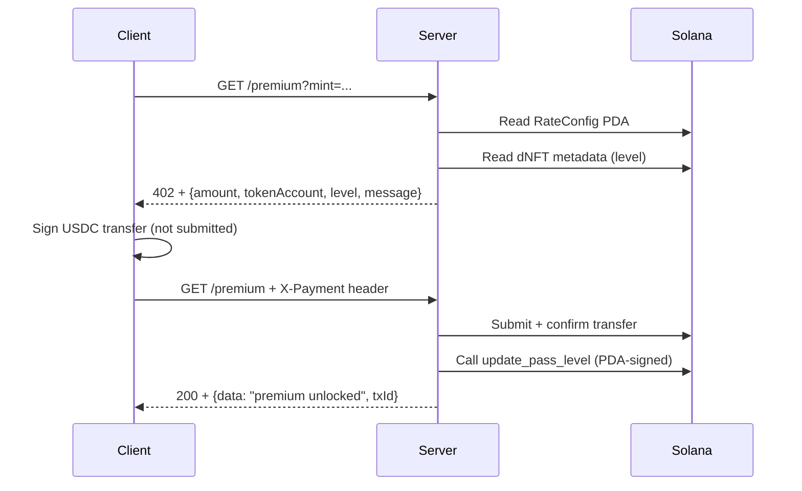

# StatePass × Solana x402 — Programmable Identity for AI Agents

> **Solana x402 Hackathon 2026** — *Minimum Viable Implementation*

StatePass is a **Token-2022 dNFT** (dynamic NFT) that acts as programmatic identity for AI agents. Combined with the **x402** payment protocol, it enables:

1. **Permission-free API access** — AI agents pay micro-transactions per API call
2. **Tiered access control** — NFT level (1→2→3) determines per-request pricing
3. **No API keys** — Payment IS authentication

## Architecture

```
┌─────────────┐       ┌──────────────────┐       ┌─────────────┐
│   AI Agent  │──────▶│  StatePass × x402 │──────▶│  Solana     │
│  (Client)   │  HTTP │  Server (Node)    │  TX   │  Devnet     │
└─────────────┘       └──────────────────┘       └─────────────┘
                             │
                             ├── Reads RateConfig PDA (pricing)
                             ├── Reads dNFT metadata (level)
                             └── Validates USDC payment
```

## Smart Contract (`programs/state-pass/`)

### Key Instructions

| Instruction | Description | Access |
|---|---|---|
| `initialize_rate_config` | Set L1/L2/L3 per-request prices | Deployer |
| `set_rate` | Update a tier's price | RateConfig authority |
| `mint_nft` | Mint StatePass dNFT (Token-2022) | Anyone |
| `update_pass_level` | Upgrade NFT level + metadata | NFT Authority PDA only |

### RateConfig PDA

- **Address (devnet):** `3GoWWZk1xbMqzKwTn5DKsgdDXjTo7g7RJbGgvkec8apU`
- **Pricing:** L1=100 (0.0001 USDC), L2=250 (0.00025 USDC), L3=300 (0.0003 USDC)

### Deployed

| Network | Program ID | 
|---|---|
| **Devnet** | `21xpRqRTFk7N7ybdPA2RyTmRqQB9FH4Xerty9jeTU1Dx` |
| Explorer | [View on SolanaFM](https://solana.fm/address/21xpRqRTFk7N7ybdPA2RyTmRqQB9FH4Xerty9jeTU1Dx?cluster=devnet-solana) |

## x402 Server (`server/`)

### Endpoints

#### `GET /status`
Returns server config + RateConfig state from the chain.

```json
{
  "program": "21xpRqRTFk7N7ybdPA2RyTmRqQB9FH4Xerty9jeTU1Dx",
  "rateConfigPda": "3GoWWZk1xbMqzKwTn5DKsgdDXjTo7g7RJbGgvkec8apU",
  "rateConfig": {
    "level1Rate": 100,
    "level2Rate": 250,
    "level3Rate": 300,
    "maxLevel": 3
  },
  "usdcMint": "4zMMC9srt5Ri5X14GAgXhaHii3GnPAEERYPJgZJDncDU",
  "recipientTokenAccount": "B11Pr7k9F4obQ54JY2vFvBG776buxp8ebC3VHXakZbjX"
}
```

#### `GET /premium?mint=<statepass-mint>`
Returns HTTP **402 Payment Required** with a payment quote.

#### `POST /premium?mint=<statepass-mint>` + `X-Payment` header
Submit a pre-signed USDC transfer as payment proof. Returns **200 OK** with premium content.

### Full E2E Flow



## Quick Start

```bash
# 1. Contract
anchor build
anchor deploy --provider.cluster devnet

# 2. Init RateConfig (one-time)
python3 scripts/init-devnet.py

# 3. Server
cd server
npm install
npx tsx src/index.ts

# 4. Test with CLI demo
npx tsx cli-demo.ts <statepass-mint-address>
```

## Test Suite

6 test cases covering the full contract surface:

1. ✅ Initialize
2. ✅ Mint NFT (Token-2022 dNFT)
3. ✅ Update pass level
4. ✅ Initialize RateConfig
5. ✅ Set rate
6. ✅ Calibrate & event emission

```bash
anchor test
```

## Tech Stack

- **Solana** + **Anchor 0.32** — smart contract framework
- **Token-2022** — dynamic NFT with on-chain metadata
- **x402 Protocol** — HTTP 402 payment for API access
- **@x402-solana/server** — payment verification middleware
- **Express** — API server

## Project Structure

```
state-pass/
├── programs/state-pass/
│   ├── src/
│   │   ├── lib.rs                  # Entry point + instruction routing
│   │   ├── state.rs                # RateConfig, NftAuthority accounts
│   │   ├── constants.rs            # PDA seeds, metadata field keys
│   │   ├── error.rs                # Custom error codes
│   │   ├── events.rs               # NftMetadataUpdated event
│   │   └── instructions/
│   │       ├── initialize.rs       # Program bootstrap
│   │       ├── mint_nft.rs         # Token-2022 dNFT minting
│   │       ├── update_pass_level.rs # Level upgrade via PDA signature
│   │       └── rate_config.rs      # Pricing configuration
├── tests/state-pass.ts             # 6 integration tests
├── server/
│   ├── src/index.ts                # x402 Express server
│   ├── cli-demo.ts                 # Interactive CLI demo
│   ├── test-e2e.ts                 # E2E integration test
│   └── init-devnet.ts              # Devnet setup script
└── Anchor.toml
```

## Next Steps

- [ ] Web frontend for minting + upgrading StatePass NFTs
- [ ] Deploy to mainnet with real USDC
- [ ] Integrate with AI agent frameworks (Eliza, LangChain)
- [ ] Add webhook notifications for level upgrades

---

*Built for Solana x402 Hackathon 2026*
